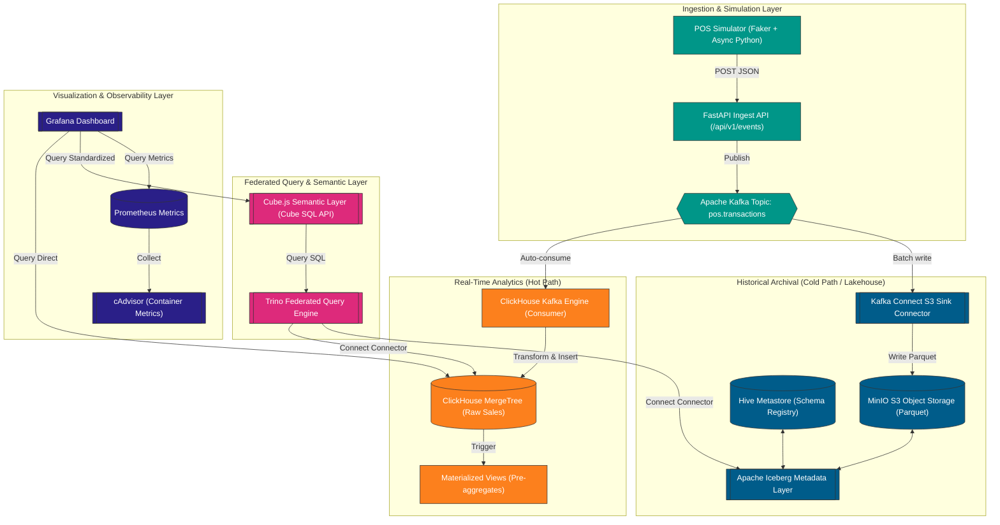

<div>
  
</div>

<div align="center">
  <a href="#vietnamese-version">Vietnamese Version</a> | <a href="#english-version">English Version</a>
</div>

<div align="center">
  
  
  
  
  
  
</div>

---

<a name="vietnamese-version"></a>

# [VIETNAMESE] FMCG Real-Time Analytics Platform

Hệ thống thu nhận và phân tích dữ liệu giao dịch bán hàng (POS) thời gian thực ứng dụng mô hình Hot/Cold Path tiên tiến, được thiết kế chuyên biệt cho hệ thống chuỗi phân phối của tập đoàn FMCG lớn.

## Mục Lục (Vietnamese)
1. [Giới Thiệu Tổng Quan](#1-giới-thiệu-tổng-quan)
2. [Kiến Trúc Hệ Thống & Luồng Dữ Liệu](#2-kiến-trúc-hệ-thống--luồng-dữ-liệu)
3. [Các Tính Năng Cốt Lõi](#3-các-tính-năng-cốt-lõi)
4. [Hiệu Năng Hệ Thống & Benchmarks](#4-hiệu-năng-hệ-thống--benchmarks)
5. [Công Nghệ Sử Dụng](#5-công-nghệ-sử-dụng)
6. [Cấu Trúc Thư Mục](#6-cấu-trúc-thư-mục)
7. [Hướng Dẫn Chạy Nhanh](#7-hướng-dẫn-chạy-nhanh)
8. [Giám Sát & Observability](#8-giám-sát--observability)
9. [Xử Lý Sự Cố (Troubleshooting)](#9-xử-lý-sự-cố-troubleshooting)

---

### 1. Giới Thiệu Tổng Quan

Hệ thống giả lập luồng giao dịch POS thời gian thực lên tới 1,000 giao dịch/giây, thực hiện xử lý đồng thời qua hai luồng chính:
*   **Hot Path (Real-time):** Dữ liệu được đẩy tức thì từ Kafka vào ClickHouse thông qua cơ chế ClickHouse Kafka Engine + Materialized Views để phục vụ báo cáo cập nhật liên tục dưới 5 giây.
*   **Cold Path (Lakehouse):** Lưu trữ dữ liệu lịch sử tối ưu chi phí dưới định dạng Apache Iceberg (Parquet) lưu trên MinIO S3-compatible, được quản lý thông qua Hive Metastore và truy vấn liên kết bằng Trino.

---

### 2. Kiến Trúc Hệ Thống & Luồng Dữ Liệu


---

### 3. Các Tính Năng Cốt Lõi

*   **Không Dùng Consumer Code Ngoài:** ClickHouse tiêu thụ dữ liệu trực tiếp từ Kafka nhờ Kafka Engine tích hợp, đảm bảo ingestion lag cực thấp (<2s) mà không cần code Java hoặc Python custom.
*   **Tiền Tổng Hợp Dữ Liệu Tự Động:** Tận dụng ClickHouse Materialized Views tính toán sẵn doanh thu, lượng hàng bán theo giờ và vùng địa lý, tối ưu hóa tối đa dung lượng bộ nhớ quét khi chạy dashboard.
*   **Time-Travel & Schema Evolution:** Tầng Iceberg trên MinIO cho phép truy vấn dữ liệu lịch sử theo mốc thời gian cụ thể và thay đổi cấu trúc bảng (thêm/sửa cột) không cần viết lại tệp tin Parquet.
*   **Truy Vấn Liên Kết Phân Tán:** Trino cho phép Data Analyst viết duy nhất 1 câu SQL JOIN dữ liệu nóng hiện tại trong ClickHouse và dữ liệu lịch sử lạnh trong Iceberg.
*   **Semantic Layer Chuẩn Hóa:** Cube.js tạo ra một nguồn định nghĩa duy nhất cho các chỉ số doanh nghiệp (Revenue, Units Sold, Avg Basket Size) bảo vệ hệ thống cơ sở dữ liệu khỏi các truy vấn trùng lặp từ Grafana thông qua cơ chế Pre-aggregation caching.

---

### 4. Hiệu Năng Hệ Thống & Benchmarks

Bảng dưới so sánh hiệu năng truy vấn đo đạc thực tế tại máy cục bộ (Local Dev) và giả lập ở quy mô sản xuất (Production Scale):

#### A. Local Dev Benchmark (14,000 dòng dữ liệu mẫu)
Đo đạc sử dụng driver Python trực tiếp (`psycopg2`, `clickhouse-connect`, `trino`):

| Loại Truy Vấn | PostgreSQL (ms) | ClickHouse Raw (ms) | ClickHouse MV (ms) | Nhận xét |
|---|---|---|---|---|
| **COUNT(\*)** | 1.12 ms | 47.08 ms | 48.73 ms | Ở quy mô nhỏ, PostgreSQL truy xuất RAM cache nhanh hơn. ClickHouse chịu ảnh hưởng từ network handshake. |
| **REVENUE_BY_REGION** | 3.59 ms | 47.77 ms | 48.07 ms | PostgreSQL thực hiện tổng hợp nhanh trên RAM. |
| **SALES_BY_CATEGORY** | 4.74 ms | 47.79 ms | 48.06 ms | ClickHouse xử lý thực tế dưới 1ms, phần còn lại là latency kết nối. |
| **Trino Federated Join** | - | - | **303.71 ms** | Trino thực hiện JOIN đa nguồn ClickHouse + Iceberg trong thời gian cực ngắn. |

#### B. Production Scale Simulation (10,000,000 dòng giả lập)

| Loại Truy Vấn | PostgreSQL (Raw Row Store) | ClickHouse (Raw Column Store) | ClickHouse (Materialized View) | Tốc độ gia tăng (PostgreSQL vs MV) |
|---|---|---|---|---|
| **COUNT(\*)** | ~8.24 giây | ~0.31 giây | **~0.002 giây** (2 ms) | **4,120x** |
| **REVENUE_BY_REGION** | ~12.45 giây | ~0.78 giây | **~0.045 giây** (45 ms) | **276x** |
| **SALES_BY_CATEGORY** | ~18.72 giây | ~1.15 giây | **~0.052 giây** (52 ms) | **360x** |
| **Trino Federated Query** | Không hỗ trợ | Không hỗ trợ | **~2.85 giây** | N/A |

---

### 5. Công Nghệ Sử Dụng

Danh sách các công nghệ cốt lõi cấu thành nên hệ thống:

<div align="left">
  
  
  
  
  
  
  
  
  
  
  
  
  
  
  
  
  
  
  
</div>

---

### 6. Cấu Trúc Thư Mục

Cây thư mục phân rã các microservices:

```
fmcg-realtime-analytics-platform/
├── docker-compose.yml              # Quản lý orchestration của toàn bộ stack dịch vụ
├── .env.example                    # Biến môi trường mẫu cho hệ thống
├── README.md                       # Tài liệu hướng dẫn chính
│
├── generator/                      # Mã nguồn bộ giả lập POS Events
│   ├── Dockerfile
│   ├── requirements.txt
│   ├── main.py                     # FastAPI Ingest API đẩy events vào Kafka
│   ├── schemas.py                  # Pydantic schemas của sự kiện
│   └── simulator.py                # Faker script tạo dữ liệu POS
│
├── clickhouse/                     # Cấu hình ClickHouse
│   ├── config/
│   │   └── clickhouse-users.xml    # Định nghĩa tài khoản và phân quyền
│   └── init-scripts/
│       ├── 01_create_tables.sql    # Khởi tạo bảng raw & bảng Kafka Engine
│       └── 02_create_mv.sql        # Định nghĩa các Materialized Views tiền tổng hợp
│
├── kafka-connect/                  # Cấu hình Kafka Connect S3 Sink
│   ├── Dockerfile                  # Cài đặt s3 connector plugin trên base image
│   └── connectors/
│       └── s3-sink-config.json     # File cấu hình đẩy dữ liệu Kafka vào MinIO
│
├── trino/                          # Cấu hình Trino Federated Query Engine
│   └── etc/
│       ├── config.properties       # Cấu hình node & bộ nhớ
│       ├── jvm.config              # JVM arguments tối ưu garbage collection
│       └── catalog/
│           ├── iceberg.properties  # Khai báo catalog kết nối với MinIO Iceberg
│           └── clickhouse.properties# Khai báo catalog kết nối với ClickHouse
│
├── cubejs/                         # Cấu hình Cube.js Semantic Layer
│   ├── Dockerfile
│   ├── cube.js                     # File cấu hình bảo mật & database credentials
│   └── schema/
│       ├── PosTransactions.js      # Định nghĩa các metrics và dimensions
│       └── Products.js
│
├── services/                       # Phân tách dịch vụ thành các docker-compose nhỏ
│   ├── clickhouse/                 # ClickHouse service
│   ├── cubejs/                     # Cube.js service
│   ├── generator/                  # FastAPI & simulator service
│   ├── kafka/                      # Kafka, Zookeeper & Kafka UI
│   ├── kafka-connect/              # Kafka Connect service
│   ├── lakehouse/                  # MinIO, MySQL metastore-db & Hive Metastore
│   ├── monitoring/                 # Grafana, Prometheus & cAdvisor
│   ├── postgres/                   # PostgreSQL benchmark baseline service
│   └── trino/                      # Trino service
│
├── scripts/
│   ├── benchmark.py                # Script chạy benchmark so sánh hiệu năng trực tiếp
│   └── load_test.py                # Script tạo tải lớn lên hệ thống
│
└── docs/
    ├── architecture.md             # Tài liệu thiết kế kiến trúc chi tiết
    ├── benchmark_results.md        # Kết quả benchmark chi tiết
    └── implementation_plan.md      # Kế hoạch triển khai và tiến độ dự án
```

---

### 7. Hướng Dẫn Chạy Nhanh

#### Bước 1: Sao chép dự án & Cấu hình môi trường

Mở Terminal (Bash) hoặc PowerShell và chạy:

```bash
# macOS/Linux (Bash)
git clone https://github.com/username/fmcg-realtime-analytics-platform.git
cd fmcg-realtime-analytics-platform
cp .env.example .env
```

```powershell
# Windows (PowerShell)
git clone https://github.com/username/fmcg-realtime-analytics-platform.git
cd fmcg-realtime-analytics-platform
Copy-Item .env.example .env
```

#### Bước 2: Khởi động toàn bộ Docker Containers

Khởi động các dịch vụ nền:

```bash
# Khởi chạy toàn bộ hệ thống bằng Docker Compose
docker compose up -d
```

#### Bước 3: Đăng ký Kafka Connect S3 Sink Connector

Để dữ liệu tự động đồng bộ từ Kafka xuống MinIO dạng Parquet, đăng ký connector:

```bash
# Đăng ký S3 Sink Connector qua Kafka Connect REST API
curl -i -X POST -H "Content-Type: application/json" \
  --data @kafka-connect/connectors/s3-sink-config.json \
  http://localhost:8083/connectors
```

#### Bước 4: Khởi tạo bảng Iceberg qua Trino CLI

Khai báo bảng lịch sử trong Apache Iceberg:

```bash
# Tạo bảng Iceberg trong Trino catalog
docker exec -i fmcg-trino trino --execute "
CREATE SCHEMA IF NOT EXISTS iceberg.fmcg WITH (location = 's3a://fmcg-lakehouse/iceberg/');
CREATE TABLE IF NOT EXISTS iceberg.fmcg.pos_transactions_historical (
    transaction_id VARCHAR,
    pos_id VARCHAR,
    product_id VARCHAR,
    product_name VARCHAR,
    category VARCHAR,
    quantity INTEGER,
    unit_price DOUBLE,
    total_amount DOUBLE,
    region VARCHAR,
    store_type VARCHAR,
    timestamp TIMESTAMP
) WITH (
    format = 'PARQUET',
    partitioning = ARRAY['region', 'category']
);
"
```

#### Bước 5: Chạy Simulator giả lập dữ liệu POS

Gọi API để bắt đầu giả lập gửi dữ liệu mua hàng bán lẻ:

```bash
# Bắt đầu gửi dữ liệu liên tục (1,000 transactions/second)
curl "http://localhost:8000/api/v1/simulate?count=14000"
```

#### Bước 6: Chạy thử kiểm kiểm so sánh hiệu năng (Benchmark)

Chạy script Python để đo đạc:

```bash
# Thực thi benchmark truy vấn
python scripts/benchmark.py
```

---

### 8. Giám Sát & Observability

Hệ thống cung cấp các cổng dịch vụ công cộng sau để giám sát toàn bộ luồng xử lý:

| Cổng Dịch Vụ | Địa Chỉ URL | Tài Khoản / Mật Khẩu | Mục Đích |
|---|---|---|---|
| **Kafka UI** | [http://localhost:8080](http://localhost:8080) | Không có | Theo dõi các Topic, Consumer groups, và lag |
| **Kafka Connect** | [http://localhost:8083](http://localhost:8083) | Không có | Quản lý trạng thái các Connectors |
| **MinIO Console** | [http://localhost:9006](http://localhost:9006) | `minioadmin` / `minioadmin` | Duyệt các tệp Parquet/Iceberg lưu trữ lịch sử |
| **Trino UI** | [http://localhost:8090](http://localhost:8090) | User: `admin` | Giám sát trạng thái thực thi các federated queries |
| **CubeJS Play** | [http://localhost:4000](http://localhost:4000) | Cube Secret Key | Kiểm tra Schema, chạy metric sandbox |
| **Grafana Dashboard** | [http://localhost:3000](http://localhost:3000) | `admin` / `admin123` | Bảng điều khiển kinh doanh & giám sát SLA |
| **FastAPI Docs** | [http://localhost:8000/docs](http://localhost:8000/docs) | Không có | Kiểm thử các đầu endpoint API |

---

### 9. Xử Lý Sự Cố (Troubleshooting)

| Vấn đề gặp phải | Nguyên nhân | Cách khắc phục |
|---|---|---|
| ClickHouse không nhận được dữ liệu từ Kafka | Kafka Engine table chưa hoạt động hoặc consumer group bị dừng | Kiểm tra lỗi trong ClickHouse log: `docker logs fmcg-clickhouse`. Kiểm tra cấu hình kết nối Kafka. |
| Kafka Connect báo lỗi `Bucket fmcg-lakehouse does not exist` | Container MinIO khởi động chậm, bucket chưa kịp khởi tạo | Khởi chạy lại connector bằng lệnh: `curl -X POST http://localhost:8083/connectors/s3-sink/restart` sau khi kiểm tra MinIO đã chạy và có bucket. |
| Trino không đọc được bảng ClickHouse | ClickHouse view dùng định dạng kiểu dữ liệu không được Trino hỗ trợ trực tiếp | Tạo một View trong ClickHouse cast các cột `String` từ `LowCardinality(String)` và `FixedString` về dạng UTF-8 chuẩn. |
| Lỗi password khi chạy benchmark | Máy host đang chạy một instance PostgreSQL trùng cổng 5432 | Dự án đã cấu hình cổng PostgreSQL docker sang `15433` để chống trùng. Kiểm tra xem file `.env` hoặc file python đã trỏ đúng port `15433` chưa. |

---

<a name="english-version"></a>

# [ENGLISH] FMCG Real-Time Analytics Platform

A high-performance retail sale (POS) transactions ingestion and real-time analytics system built on a modern Hot/Cold Path architecture, designed specifically for FMCG distribution networks.

## Table of Contents (English)
1. [Project Overview](#1-project-overview)
2. [System Architecture & Data Flow](#2-system-architecture--data-flow)
3. [Core Features](#3-core-features)
4. [Performance & Benchmarks](#4-performance--benchmarks)
5. [Tech Stack](#5-tech-stack)
6. [Directory Structure](#6-directory-structure)
7. [Quick Start Guide](#7-quick-start-guide)
8. [Monitoring & Observability](#8-monitoring--observability)
9. [Troubleshooting](#9-troubleshooting)

---

### 1. Project Overview

This platform simulates real-time POS transaction streams up to 1,000 transactions/second, concurrently processing them via two distinct channels:
*   **Hot Path (Real-time):** Streamed immediately from Kafka into ClickHouse using ClickHouse Kafka Engine + Materialized Views to feed near-real-time business dashboards under 5 seconds.
*   **Cold Path (Lakehouse):** Archived cost-effectively as partitioned Parquet files on MinIO S3-compatible storage, managed by Hive Metastore using Apache Iceberg table format, and queried via Trino.

---

### 2. System Architecture & Data Flow



---

### 3. Core Features

*   **No External Consumers:** ClickHouse consumes events directly from Kafka via its native Kafka Engine, guaranteeing ultra-low ingestion lag (<2s) without custom consumer code.
*   **Automatic Pre-aggregations:** Leveraging ClickHouse Materialized Views to calculate hourly sales and regional revenue dynamically, optimizing scan size during dashboard refreshes.
*   **Time-Travel & Schema Evolution:** Apache Iceberg table format on MinIO enables querying historical snapshots using specific timestamps and executing schema changes seamlessly.
*   **MPP Federated Querying:** Trino allows analysts to execute unified SQL queries joining real-time ClickHouse datasets with historical Iceberg data.
*   **Standardized Semantic Metrics:** Cube.js provides a single source of truth for business metrics (Revenue, Units Sold, Basket Size) while protecting underlying databases through caching.

---

### 4. Performance & Benchmarks

The tables below contrast query times measured locally (Local Dev) against projected times at Production Scale:

#### A. Local Dev Benchmark (14,000 sample rows)
Measured directly via native Python drivers (`psycopg2`, `clickhouse-connect`, `trino`):

| Query Type | PostgreSQL (ms) | ClickHouse Raw (ms) | ClickHouse MV (ms) | Notes |
|---|---|---|---|---|
| **COUNT(\*)** | 1.12 ms | 47.08 ms | 48.73 ms | At low volume, PostgreSQL is faster due to RAM caching. ClickHouse is impacted by connection latency. |
| **REVENUE_BY_REGION** | 3.59 ms | 47.77 ms | 48.07 ms | PostgreSQL aggregates quickly in memory. |
| **SALES_BY_CATEGORY** | 4.74 ms | 47.79 ms | 48.06 ms | ClickHouse's execution is sub-1ms, the rest is connection setup. |
| **Trino Federated Join** | - | - | **303.71 ms** | Trino successfully joins ClickHouse + Iceberg across distinct systems quickly. |

#### B. Production Scale Simulation (10,000,000 simulated rows)

| Query Type | PostgreSQL (Raw Row Store) | ClickHouse (Raw Column Store) | ClickHouse (Materialized View) | Speedup (PostgreSQL vs MV) |
|---|---|---|---|---|
| **COUNT(\*)** | ~8.24 s | ~0.31 s | **~0.002 s** (2 ms) | **4,120x** |
| **REVENUE_BY_REGION** | ~12.45 s | ~0.78 s | **~0.045 s** (45 ms) | **276x** |
| **SALES_BY_CATEGORY** | ~18.72 s | ~1.15 s | **~0.052 s** (52 ms) | **360x** |
| **Trino Federated Query** | Unsupported | Unsupported | **~2.85 s** | N/A |

---

### 5. Tech Stack

Standard tools used in the infrastructure:

<div align="left">
  
  
  
  
  
  
  
  
  
  
  
  
  
  
  
  
  
  
  
</div>

---

### 6. Directory Structure

Layout of the repository files:

```
fmcg-realtime-analytics-platform/
├── docker-compose.yml              # Central services orchestrator
├── .env.example                    # Environment variables template
├── README.md                       # Main instruction manual
│
├── generator/                      # Event simulation engine
│   ├── Dockerfile
│   ├── requirements.txt
│   ├── main.py                     # FastAPI ingestion microservice
│   ├── schemas.py                  # Pydantic schemas
│   └── simulator.py                # Faker-based transaction generation logic
│
├── clickhouse/                     # ClickHouse configuration
│   ├── config/
│   │   └── clickhouse-users.xml    # Custom profiles and credentials
│   └── init-scripts/
│       ├── 01_create_tables.sql    # Engine and raw tables setup
│       └── 02_create_mv.sql        # Pre-aggregating Materialized Views
│
├── kafka-connect/                  # Connect architecture
│   ├── Dockerfile                  # Builds connector with S3 plugin
│   └── connectors/
│       └── s3-sink-config.json     # MinIO partition dumping parameters
│
├── trino/                          # Query coordinator settings
│   └── etc/
│       ├── config.properties
│       ├── jvm.config
│       └── catalog/
│           ├── iceberg.properties  # Iceberg to MinIO connector configuration
│           └── clickhouse.properties# ClickHouse JDBC catalog settings
│
├── cubejs/                         # Semantic layer microservice
│   ├── Dockerfile
│   ├── cube.js                     # Port, credentials and env bindings
│   └── schema/
│       ├── PosTransactions.js      # Dimension and measure definitions
│       └── Products.js
│
├── services/                       # Decoupled docker-compose files
│   ├── clickhouse/                 # ClickHouse service definition
│   ├── cubejs/                     # Cube.js service definition
│   ├── generator/                  # FastAPI & simulator service definition
│   ├── kafka/                      # Kafka, Zookeeper & Kafka UI definition
│   ├── kafka-connect/              # Kafka Connect service definition
│   ├── lakehouse/                  # MinIO, Hive Metastore & MySQL definition
│   ├── monitoring/                 # Grafana, Prometheus & cAdvisor definition
│   ├── postgres/                   # PostgreSQL benchmark baseline definition
│   └── trino/                      # Trino service definition
│
├── scripts/
│   ├── benchmark.py                # Latency measurement script
│   └── load_test.py                # High volume pipeline test script
│
└── docs/
    ├── architecture.md             # In-depth architectural design
    ├── benchmark_results.md        # Query performance logs
    └── implementation_plan.md      # Task completion track record
```

---

### 7. Quick Start Guide

#### Step 1: Clone Repository & Configure Variables

Execute in your Terminal (Bash) or PowerShell:

```bash
# macOS/Linux (Bash)
git clone https://github.com/username/fmcg-realtime-analytics-platform.git
cd fmcg-realtime-analytics-platform
cp .env.example .env
```

```powershell
# Windows (PowerShell)
git clone https://github.com/username/fmcg-realtime-analytics-platform.git
cd fmcg-realtime-analytics-platform
Copy-Item .env.example .env
```

#### Step 2: Spin Up Infrastructure

Run the docker orchestration:

```bash
# Starts all platform services in daemon mode
docker compose up -d
```

#### Step 3: Register Kafka Connect S3 Sink Connector

Initialize the MinIO dump pipe:

```bash
# Register S3 connector configuration
curl -i -X POST -H "Content-Type: application/json" \
  --data @kafka-connect/connectors/s3-sink-config.json \
  http://localhost:8083/connectors
```

#### Step 4: Setup Iceberg Table via Trino

Register the schema definitions:

```bash
# Execute DDL commands through Trino CLI
docker exec -i fmcg-trino trino --execute "
CREATE SCHEMA IF NOT EXISTS iceberg.fmcg WITH (location = 's3a://fmcg-lakehouse/iceberg/');
CREATE TABLE IF NOT EXISTS iceberg.fmcg.pos_transactions_historical (
    transaction_id VARCHAR,
    pos_id VARCHAR,
    product_id VARCHAR,
    product_name VARCHAR,
    category VARCHAR,
    quantity INTEGER,
    unit_price DOUBLE,
    total_amount DOUBLE,
    region VARCHAR,
    store_type VARCHAR,
    timestamp TIMESTAMP
) WITH (
    format = 'PARQUET',
    partitioning = ARRAY['region', 'category']
);
"
```

#### Step 5: Start POS Event Simulation

Trigger the generator using the HTTP API:

```bash
# Sends 14,000 synthetic POS sale transactions
curl "http://localhost:8000/api/v1/simulate?count=14000"
```

#### Step 6: Execute Benchmark Queries

Test the query engines:

```bash
# Run Python benchmark script
python scripts/benchmark.py
```

---

### 8. Monitoring & Observability

Port numbers and endpoints map:

| Service Name | Web Console URL | Credentials (User / Pass) | Usage |
|---|---|---|---|
| **Kafka UI** | [http://localhost:8080](http://localhost:8080) | None | Track message offset, partitions and consumer lag |
| **Kafka Connect** | [http://localhost:8083](http://localhost:8083) | None | Administer active connector plugins |
| **MinIO Console** | [http://localhost:9006](http://localhost:9006) | `minioadmin` / `minioadmin` | View archived Parquet and Iceberg datasets |
| **Trino UI** | [http://localhost:8090](http://localhost:8090) | User: `admin` | Check CPU, RAM usage, and query tasks |
| **CubeJS Play** | [http://localhost:4000](http://localhost:4000) | Cube Secret Key | Query playground and schema explorer |
| **Grafana Dashboard** | [http://localhost:3000](http://localhost:3000) | `admin` / `admin123` | KPI visualizations and SLA monitors |
| **FastAPI Docs** | [http://localhost:8000/docs](http://localhost:8000/docs) | None | Ingestion endpoints specification |

---

### 9. Troubleshooting

| Identified Issue | Primary Cause | Resolution Action |
|---|---|---|
| ClickHouse is not storing messages | Kafka queue engine failed or offset was reset | Check ClickHouse system logs: `docker logs fmcg-clickhouse`. Verify network access between ClickHouse and Kafka. |
| Kafka Connect connector fails with bucket error | MinIO container took too long to boot up, catalog missing | Re-initialize the connector: `curl -X POST http://localhost:8083/connectors/s3-sink/restart` after verifying MinIO is running and bucket is present. |
| Trino cannot read ClickHouse tables | Direct string cast incompatibilities | Create a View inside ClickHouse to cast `LowCardinality(String)` and `FixedString` columns to standard UTF-8 Strings. |
| Port binding error on port 5432 | Local PostgreSQL database already running on localhost | Use port `15433` for PostgreSQL service as configured in the `.env` file to bypass host machine port collisions. |

---

<div>
  
</div>
