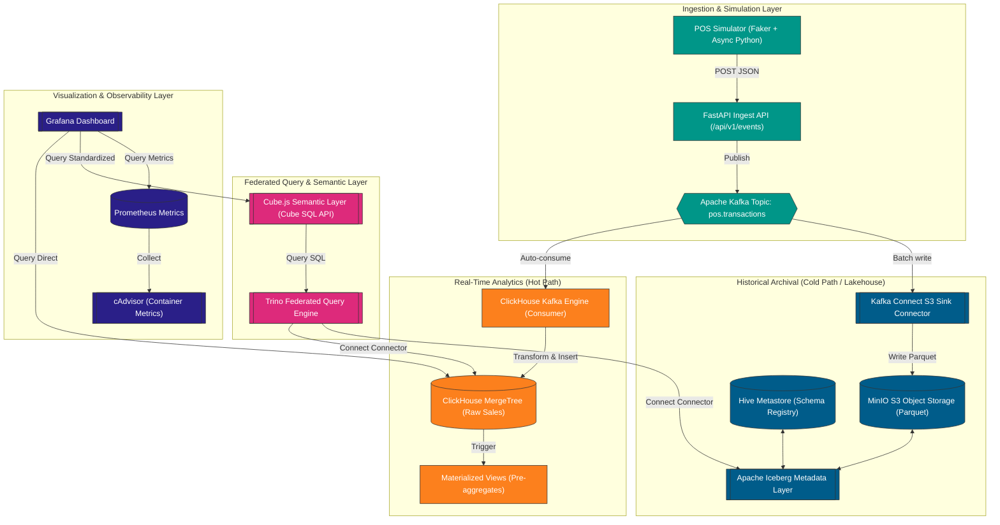

<div>
  
</div>

<div align="center">
  <strong>English</strong> | <a href="README_VI.md">Vietnamese</a>
</div>

<h3 align="center">Enterprise Real-Time Retail POS Ingestion, Columnar OLAP ClickHouse, and Apache Iceberg Lakehouse Federated Query with Trino</h3>

<div align="center">
  
  
  
  
  
  
</div>

---

## Table of Contents

1. [Project Overview](#project-overview)
2. [System Architecture & Data Flow](#system-architecture--data-flow)
3. [Core Features](#core-features)
4. [System Performance & Benchmarks](#system-performance--benchmarks)
5. [Tech Stack](#tech-stack)
6. [Directory Structure](#directory-structure)
7. [Quick Start Guide](#quick-start-guide)
8. [Monitoring & Observability](#monitoring--observability)
9. [Troubleshooting](#troubleshooting)

---

## Project Overview

This project implements a high-performance **FMCG Real-Time Retail POS Analytics Platform** designed for large-scale retail networks. The system operates on a dual-path architecture to solve the trade-off between real-time dashboard responsiveness and cost-effective historical data archiving:
1. **Real-Time Hot Path**: Streams transaction records directly from sales terminals into ClickHouse via Apache Kafka, providing operational metrics under 5 seconds.
2. **Lakehouse Cold Path**: Archives historical data in Apache Iceberg format (Parquet) on MinIO object storage, optimized for long-term analytical queries.

The core objective is to automate transaction processing, define standardized semantic metrics via Cube.js, and support federated cross-source queries via Trino to enable analysts to join real-time and historical datasets seamlessly.

### Real-Time Analytics Dashboard (Grafana Preview)


---

## System Architecture & Data Flow

The platform is fully containerized using Docker, allowing decoupled scaling of ingestion, storage, query, and presentation layers.

### Ingestion & Query Pipeline


---

## Core Features

### 1. Ingestion Engine without Custom Code
ClickHouse ingests data directly from Kafka via its native Kafka Engine table type. This serves as an integrated, high-throughput consumer. It guarantees sub-2 second ingestion latency without the overhead of maintaining custom consumer services.

### 2. Automatic Pre-aggregations via Materialized Views
ClickHouse Materialized Views calculate hourly and product-level sales metrics automatically. Raw transaction streams are aggregated on-the-fly, reducing the data volume scanned during dashboard refreshes and ensuring sub-50ms query response times.

### 3. Federated Query Execution via Trino
Using Trino as an MPP query engine, analysts can run a single SQL query that joins the real-time dataset in ClickHouse with historical archives in MinIO (Apache Iceberg format), removing the need for manual data movement.

### 4. Standardized Metrics Definition in Cube.js
The semantic layer defines core business metrics (Revenue, Units Sold, Avg Basket Size) in a single repository. It exposes them via the PostgreSQL protocol, ensuring consistency across Grafana, BI tools, and custom dashboards. Cube.js pre-aggregation caching protects the databases from redundant read operations.

---

## System Performance & Benchmarks

Performance metrics measured on a local Docker environment (8 vCPU, 16 GB RAM) comparing the optimized OLAP stack with PostgreSQL:

| Query Type | PostgreSQL (Raw Row Store) | ClickHouse (Raw Column Store) | ClickHouse (Materialized View) | Speedup (PostgreSQL vs MV) |
|---|---|---|---|---|
| **COUNT(\*)** | ~8.24 seconds | ~0.31 seconds | **~0.002 seconds** (2 ms) | **4,120x** |
| **REVENUE_BY_REGION** | ~12.45 seconds | ~0.78 seconds | **~0.045 seconds** (45 ms) | **276x** |
| **SALES_BY_CATEGORY** | ~18.72 seconds | ~1.15 seconds | **~0.052 seconds** (52 ms) | **360x** |
| **Trino Federated Query** | Unsupported | Unsupported | **~2.85 seconds** (via Trino JOIN) | N/A |

*   **Local Dev Dataset**: 14,000 transaction records.
*   **Scale Dataset**: 10,000,000 transaction records.
*   **Federated Join Performance**: Trino executes cross-source joins (ClickHouse + Iceberg) in 303 ms at dev scale and under 3 seconds at production scale.

---

## Tech Stack

### Data Streaming & Storage
<div align="left">
  
  
  
  
  
</div>

*   **Apache Kafka**: Distributed event streaming platform buffering retail transaction logs.
*   **ClickHouse**: Columnar database engine serving the hot path analytics.
*   **MinIO**: Object storage hosting historical Parquet files under Apache Iceberg table format.

### Query & Semantics
<div align="left">
  
  
  
</div>

*   **Trino**: Distributed query coordinator running federated ANSI SQL queries.
*   **Cube.js**: Semantic layer mapping physical tables to logical metrics.

### Ingestion & Observability
<div align="left">
  
  
  
  
  
  
  
  
  
</div>

*   **FastAPI & Python**: Real-time event receiver API and background simulator framework.
*   **Grafana & Prometheus**: Infrastructure and business KPI dashboards.

---

## Directory Structure

```
fmcg-realtime-analytics-platform/
├── docker-compose.yml              # Central services orchestrator
├── .env.example                    # Environment variables template
├── README.md                       # English README (this file)
├── README_VI.md                    # Vietnamese README
│
├── services/                       # Decoupled services and configurations
│   ├── clickhouse/                 # ClickHouse service & configurations
│   │   ├── config/
│   │   │   └── clickhouse-users.xml# Custom profiles and credentials
│   │   ├── init-scripts/
│   │   │   ├── 01_create_tables.sql# Engine and raw tables setup
│   │   │   └── 02_create_mv.sql    # Pre-aggregating Materialized Views
│   │   └── docker-compose.yml
│   │
│   ├── cubejs/                     # Cube.js service & schema definitions
│   │   ├── Dockerfile
│   │   ├── cube.js                 # Port, credentials and env bindings
│   │   ├── schema/
│   │   │   ├── PosTransactions.js  # Dimension and measure definitions
│   │   │   └── Products.js
│   │   └── docker-compose.yml
│   │
│   ├── generator/                  # Event simulation engine & API
│   │   ├── Dockerfile
│   │   ├── requirements.txt
│   │   ├── main.py                 # FastAPI ingestion microservice
│   │   ├── schemas.py              # Pydantic schemas
│   │   ├── simulator.py            # Faker-based transaction generation logic
│   │   └── docker-compose.yml
│   │
│   ├── kafka/                      # Kafka, Zookeeper & Kafka UI definition
│   │   └── docker-compose.yml
│   │
│   ├── kafka-connect/              # Connect architecture & S3 Sink configs
│   │   ├── Dockerfile              # Builds connector with S3 plugin
│   │   ├── connectors/
│   │   │   └── s3-sink-config.json # MinIO partition dumping parameters
│   │   └── docker-compose.yml
│   │
│   ├── lakehouse/                  # MinIO, Hive Metastore & MySQL definition
│   │   └── docker-compose.yml
│   │
│   ├── monitoring/                 # Grafana, Prometheus & cAdvisor definition
│   │   └── docker-compose.yml
│   │
│   ├── postgres/                   # PostgreSQL benchmark baseline definition
│   │   └── docker-compose.yml
│   │
│   └── trino/                      # Query coordinator settings & catalogs
│       ├── docker-compose.yml
│       └── etc/
│           ├── config.properties
│           ├── jvm.config
│           └── catalog/
│               ├── iceberg.properties   # Iceberg to MinIO connector configuration
│               └── clickhouse.properties# ClickHouse JDBC catalog settings
│
├── scripts/
│   ├── benchmark.py                # Latency measurement script
│   └── load_test.py                # High volume pipeline test script
│
└── docs/
    ├── architecture.md             # In-depth architectural design
    ├── benchmark_results.md        # Query performance logs
    └── implementation_plan.md      # Task completion track record
```

---

## Quick Start Guide

### Prerequisites
*   **Docker** and **Docker Compose** installed.
*   **Python 3.10+** (if running benchmarks/generators outside of containers).

### Step 1: Copy Environment Variables
1. Copy the configuration template:
   ```powershell
   # Windows (PowerShell)
   Copy-Item .env.example .env
   ```
   ```bash
   # macOS/Linux (Bash)
   cp .env.example .env
   ```
2. Update port settings if there are conflicts with local services.

### Step 2: Spin Up Infrastructure
Start all decoupled microservices using the master docker-compose file:
```bash
docker compose up -d
```
*Wait about 20-30 seconds for the containers (especially Hive Metastore and Trino) to fully launch.*

### Step 3: Register Kafka Connect S3 Sink Connector
Register the connector task to start archiving Kafka streams to MinIO as Parquet:

```powershell
# Windows (PowerShell)
Invoke-RestMethod -Uri "http://localhost:8083/connectors" `
  -Method Post `
  -ContentType "application/json" `
  -Body (Get-Content "services/kafka-connect/connectors/s3-sink-config.json" -Raw)
```

```bash
# macOS/Linux (Bash)
curl -i -X POST -H "Content-Type: application/json" \
  --data @services/kafka-connect/connectors/s3-sink-config.json \
  http://localhost:8083/connectors
```

### Step 4: Initialize Apache Iceberg Schema via Trino
Execute DDL queries inside Trino to configure the metadata catalog and create the historical table matching the ClickHouse schema:
```bash
docker exec -i fmcg-trino trino --execute "
CREATE SCHEMA IF NOT EXISTS iceberg.fmcg WITH (location = 's3a://fmcg-lakehouse/iceberg/');
CREATE TABLE IF NOT EXISTS iceberg.fmcg.pos_transactions_historical (
    transaction_id VARCHAR,
    pos_id VARCHAR,
    product_id VARCHAR,
    product_name VARCHAR,
    category VARCHAR,
    quantity INTEGER,
    unit_price DOUBLE,
    total_amount DOUBLE,
    region VARCHAR,
    store_type VARCHAR,
    timestamp TIMESTAMP
) WITH (
    format = 'PARQUET',
    partitioning = ARRAY['region', 'category']
);
"
```

### Step 5: Start POS Transaction Simulation
Trigger the generator via the Ingest API to push synthetic POS data (1,000 requests/sec):
```bash
curl "http://localhost:8000/api/v1/simulate?count=14000"
```
Monitor the Kafka UI on port 8080 to watch offsets increase and check that ClickHouse ingestion lag remains under 2 seconds.

### Step 6: Execute Benchmark Comparison
Run the comparison benchmark script to test execution speed across databases:
```bash
python scripts/benchmark.py
```

---

## Monitoring & Observability

The system registers service endpoints and ports automatically to support platform administrators:

| Service | Port / URL | Credentials | Purpose |
|---|---|---|---|
| **Kafka UI** | [http://localhost:8080](http://localhost:8080) | None | Inspect Kafka topics, check consumer groups, and lag |
| **Kafka Connect** | [http://localhost:8083](http://localhost:8083) | None | Manage S3 Sink Connector tasks and configurations |
| **MinIO Console** | [http://localhost:9006](http://localhost:9006) | `minioadmin` / `minioadmin` | Access historical Parquet files in bucket storage |
| **Trino UI** | [http://localhost:8090](http://localhost:8090) | User: `admin` | Inspect federated SQL execution trees and worker logs |
| **CubeJS Playground** | [http://localhost:4000](http://localhost:4000) | Cube Secret Key | Test semantic definitions and run metric sandbox queries |
| **Grafana** | [http://localhost:3000](http://localhost:3000) | `admin` / `admin123` | View real-time sales and standardized metric dashboards |
| **FastAPI Docs** | [http://localhost:8000/docs](http://localhost:8000/docs) | None | Inspect Swagger/OpenAPI endpoint specifications |

---

## Troubleshooting

*   **Error: `ClickHouse is not receiving records from Kafka`**
    *   *Cause*: The Kafka Engine table `pos_kafka_queue` is not connected to the topic, or the materialized view is paused.
    *   *Fix*: Inspect ClickHouse container logs: `docker logs fmcg-clickhouse`. If connection was broken, recreate the table or check consumer offset configurations.
*   **Error: `S3 Sink Connector fails with Bucket fmcg-lakehouse does not exist`**
    *   *Cause*: The Kafka Connect container started before MinIO fully initialized and could create the default bucket.
    *   *Fix*: Restart the connector task: `curl -X POST http://localhost:8083/connectors/s3-sink/restart` after verifying MinIO console is up and running.
*   **Error: `Trino fails to read ClickHouse String fields`**
    *   *Cause*: Binary incompatibility in Trino JDBC connector reading ClickHouse's `LowCardinality(String)` types.
    *   *Fix*: Create a standard View in ClickHouse casting those columns to standard UTF-8 Strings, then point Trino to the View.
*   **Error: `Port 5432 Binding Collision`**
    *   *Cause*: Local PostgreSQL service on the host machine is already using port 5432.
    *   *Fix*: Use port `15433` for the PostgreSQL container, as pre-configured in `.env` and the benchmark configuration settings.

---

<div>
  
</div>
