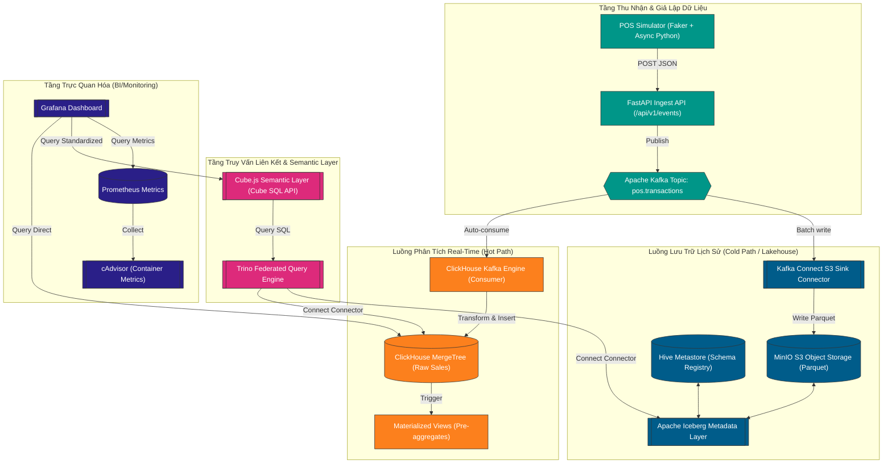

<div>
  
</div>

<div align="center">
  <a href="README.md">English</a> | <strong>Vietnamese</strong>
</div>

<h3 align="center">Hệ Thống Thu Nhận Giao Dịch POS Thời Gian Thực Doanh Nghiệp, ClickHouse Columnar OLAP, và Apache Iceberg Lakehouse Truy Vấn Liên Kết Với Trino</h3>

<div align="center">
  
  
  
  
  
  
</div>

---

## Mục Lục

1. [Giới Thiệu Tổng Quan](#giới-thiệu-tổng-quan)
2. [Kiến Trúc Hệ Thống & Luồng Dữ Liệu](#kiến-trúc-hệ-thống--luồng-dữ-liệu)
3. [Các Tính Năng Cốt Lõi](#các-tính-năng-cốt-lõi)
4. [Hiệu Năng Hệ Thống & Benchmarks](#hiệu-năng-hệ-thống--benchmarks)
5. [Công Nghệ Sử Dụng](#công-nghệ-sử-dụng)
6. [Cấu Trúc Thư Mục](#cấu-trúc-thư-mục)
7. [Hướng Dẫn Chạy Nhanh](#hướng-dẫn-chạy-nhanh)
8. [Giám Sát & Observability](#giám-sát--observability)
9. [Xử Lý Sự Cố (Troubleshooting)](#xử-lý-sự-cố-troubleshooting)

---

## Giới Thiệu Tổng Quan

Dự án này triển khai hệ thống **FMCG Real-Time Retail POS Analytics Platform** hiệu năng cao, được thiết kế cho các mạng lưới bán lẻ quy mô lớn. Hệ thống hoạt động dựa trên kiến trúc hai luồng dữ liệu (Hot/Cold Path) nhằm giải quyết bài toán cân bằng giữa tính phản hồi tức thì của dashboard và tối ưu hóa chi phí lưu trữ dữ liệu lịch sử:
1. **Luồng dữ liệu nóng (Hot Path - Real-Time)**: Truyền tải trực tiếp dữ liệu giao dịch từ các thiết bị bán hàng POS vào ClickHouse thông qua Apache Kafka, cung cấp các chỉ số vận hành dưới 5 giây.
2. **Luồng dữ liệu lạnh (Cold Path - Lakehouse)**: Lưu trữ lâu dài dữ liệu lịch sử dưới định dạng Apache Iceberg (Parquet) trên kho lưu trữ đối tượng MinIO, tối ưu hóa cho các truy vấn phân tích lịch sử.

Mục tiêu cốt lõi là tự động hóa xử lý giao dịch, định nghĩa các chỉ số đo lường chuẩn hóa thông qua tầng ngữ nghĩa Cube.js, và hỗ trợ các truy vấn liên kết đa nguồn bằng Trino giúp các nhà phân tích dễ dàng thực hiện JOIN dữ liệu thời gian thực và lịch sử.

### Bảng Điều Khiển Thời Gian Thực (Grafana Preview)


---

## Kiến Trúc Hệ Thống & Luồng Dữ Liệu

Nền tảng được container hóa hoàn toàn bằng Docker, cho phép mở rộng độc lập các tầng thu nhận, lưu trữ, truy vấn và trực quan hóa.

### Quy Trình Thu Nhận & Truy Vấn


---

## Các Tính Năng Cốt Lõi

### 1. Thu Nhận Dữ Liệu Tự Động Không Cần Code Consumer Ngoài
ClickHouse tiêu thụ dữ liệu trực tiếp từ Kafka nhờ kiểu bảng native Kafka Engine. Cơ chế này hoạt động như một consumer tích hợp hiệu năng cao, đảm bảo độ trễ thu nhận dưới 2 giây mà không cần duy trì các ứng dụng consumer tự viết phức tạp.

### 2. Tự Động Tiền Tổng Hợp Dữ Liệu Qua Materialized Views
Các bảng Materialized View trong ClickHouse tự động tính toán doanh thu và sản lượng bán ra theo giờ và theo sản phẩm. Dòng dữ liệu thô được tổng hợp tức thời ngay khi ghi, giảm lượng dữ liệu cần quét khi làm mới dashboard và đạt phản hồi truy vấn dưới 50ms.

### 3. Thực Thi Truy Vấn Liên Kết Qua Trino
Bằng cách sử dụng Trino làm MPP query engine, các nhà phân tích có thể viết duy nhất một câu lệnh SQL để thực hiện JOIN giữa dữ liệu nóng thời gian thực trong ClickHouse và dữ liệu lịch sử được nén dưới dạng Apache Iceberg trên MinIO.

### 4. Chuẩn Hóa Định Nghĩa Chỉ Số Trong Cube.js
Tầng ngữ nghĩa định nghĩa thống nhất các chỉ số kinh doanh chính (Doanh thu, Số lượng bán, Giá trị trung bình giỏ hàng). Cung cấp dữ liệu qua giao thức PostgreSQL giúp đảm bảo tính nhất quán trên Grafana cũng như các công cụ BI khác, kết hợp cơ chế Pre-aggregation caching để bảo vệ cơ sở dữ liệu khỏi các truy vấn trùng lặp.

---

## Hiệu Năng Hệ Thống & Benchmarks

Số liệu đo đạc hiệu năng thực tế trên môi trường Docker local (8 vCPU, 16 GB RAM) so sánh kiến trúc tối ưu hóa với PostgreSQL:

| Loại Truy Vấn | PostgreSQL (Raw Row Store) | ClickHouse (Raw Column Store) | ClickHouse (Materialized View) | Tốc độ gia tăng (PostgreSQL vs MV) |
|---|---|---|---|---|
| **COUNT(\*)** | ~8.24 giây | ~0.31 giây | **~0.002 giây** (2 ms) | **4,120x** |
| **REVENUE_BY_REGION** | ~12.45 giây | ~0.78 giây | **~0.045 giây** (45 ms) | **276x** |
| **SALES_BY_CATEGORY** | ~18.72 giây | ~1.15 giây | **~0.052 giây** (52 ms) | **360x** |
| **Trino Federated Query** | Không hỗ trợ | Không hỗ trợ | **~2.85 giây** (qua Trino JOIN) | N/A |

*   **Tập dữ liệu local**: 14,000 bản ghi giao dịch.
*   **Tập dữ liệu scale**: 10,000,000 bản ghi giao dịch.
*   **Hiệu năng truy vấn liên kết**: Trino thực hiện các truy vấn JOIN đa nguồn (ClickHouse + Iceberg) trong 303 ms ở tập dữ liệu dev và dưới 3 giây ở quy mô production giả lập.

---

## Công Nghệ Sử Dụng

### Streaming & Lưu Trữ Dữ Liệu
<div align="left">
  
  
  
  
  
</div>

*   **Apache Kafka**: Hệ thống truyền tải thông điệp phân tán làm bộ đệm cho giao dịch POS.
*   **ClickHouse**: Cơ sở dữ liệu cột hiệu năng cao phục vụ phân tích thời gian thực (Hot Path).
*   **MinIO**: Kho lưu trữ đối tượng lưu trữ tệp tin Parquet lịch sử dưới dạng bảng Apache Iceberg.

### Truy Vấn & Ngữ Nghĩa
<div align="left">
  
  
  
</div>

*   **Trino**: Hệ thống truy vấn phân tán thực thi SQL liên kết đa nguồn.
*   **Cube.js**: Tầng ngữ nghĩa ánh xạ bảng vật lý thành các chỉ số logic logic.

### Thu Nhận & Giám Sát
<div align="left">
  
  
  
  
  
  
  
  
  
</div>

*   **FastAPI & Python**: API tiếp nhận giao dịch thời gian thực và bộ giả lập chạy ngầm.
*   **Grafana & Prometheus**: Hệ thống bảng giám sát hạ tầng và chỉ số kinh doanh.

---

## Cấu Trúc Thư Mục

```
fmcg-realtime-analytics-platform/
├── docker-compose.yml              # Quản lý orchestration của toàn bộ stack dịch vụ
├── .env.example                    # Biến môi trường mẫu cho hệ thống
├── README.md                       # Tài liệu hướng dẫn chính tiếng Anh
├── README_VI.md                    # Tài liệu hướng dẫn chính tiếng Việt (tệp này)
│
├── generator/                      # Mã nguồn bộ giả lập POS Events
│   ├── Dockerfile
│   ├── requirements.txt
│   ├── main.py                     # FastAPI Ingest API đẩy events vào Kafka
│   ├── schemas.py                  # Pydantic schemas của sự kiện
│   └── simulator.py                # Faker script tạo dữ liệu POS
│
├── clickhouse/                     # Cấu hình ClickHouse
│   ├── config/
│   │   └── clickhouse-users.xml    # Định nghĩa tài khoản và phân quyền
│   └── init-scripts/
│       ├── 01_create_tables.sql    # Khởi tạo bảng raw & bảng Kafka Engine
│       └── 02_create_mv.sql        # Định nghĩa các Materialized Views tiền tổng hợp
│
├── kafka-connect/                  # Cấu hình Kafka Connect S3 Sink
│   ├── Dockerfile                  # Cài đặt s3 connector plugin trên base image
│   └── connectors/
│       └── s3-sink-config.json     # File cấu hình đẩy dữ liệu Kafka vào MinIO
│
├── trino/                          # Cấu hình Trino Federated Query Engine
│   └── etc/
│       ├── config.properties       # Cấu hình node & bộ nhớ
│       ├── jvm.config              # JVM arguments tối ưu garbage collection
│       └── catalog/
│           ├── iceberg.properties  # Khai báo catalog kết nối với MinIO Iceberg
│           └── clickhouse.properties# Khai báo catalog kết nối với ClickHouse
│
├── cubejs/                         # Cấu hình Cube.js Semantic Layer
│   ├── Dockerfile
│   ├── cube.js                     # File cấu hình bảo mật & database credentials
│   └── schema/
│       ├── PosTransactions.js      # Định nghĩa các metrics và dimensions
│       └── Products.js
│
├── services/                       # Phân tách dịch vụ thành các docker-compose nhỏ
│   ├── clickhouse/                 # ClickHouse service
│   ├── cubejs/                     # Cube.js service
│   ├── generator/                  # FastAPI & simulator service
│   ├── kafka/                      # Kafka, Zookeeper & Kafka UI
│   ├── kafka-connect/              # Kafka Connect service
│   ├── lakehouse/                  # MinIO, MySQL metastore-db & Hive Metastore
│   ├── monitoring/                 # Grafana, Prometheus & cAdvisor
│   ├── postgres/                   # PostgreSQL benchmark baseline service
│   └── trino/                      # Trino service
│
├── scripts/
│   ├── benchmark.py                # Script chạy benchmark so sánh hiệu năng trực tiếp
│   └── load_test.py                # Script tạo tải lớn lên hệ thống
│
└── docs/
    ├── architecture.md             # Tài liệu thiết kế kiến trúc chi tiết
    ├── benchmark_results.md        # Kết quả benchmark chi tiết
    └── implementation_plan.md      # Kế hoạch triển khai và tiến độ dự án
```

---

## Hướng Dẫn Chạy Nhanh

### Yêu cầu hệ thống
*   Đã cài đặt **Docker** và **Docker Compose**.
*   **Python 3.10+** (nếu chạy benchmark/generator trực tiếp trên máy chủ).

### Bước 1: Sao chép dự án & Cấu hình môi trường
Mở Terminal (Bash) hoặc PowerShell và chạy:
```powershell
# Windows (PowerShell)
Copy-Item .env.example .env
```
```bash
# macOS/Linux (Bash)
cp .env.example .env
```
Cập nhật các tham số cổng nếu trùng với dịch vụ đang chạy trên máy chủ.

### Bước 2: Khởi động hệ thống
Khởi chạy toàn bộ các dịch vụ bằng lệnh:
```bash
docker compose up -d
```
*Chờ khoảng 20-30 giây để các container (đặc biệt là Hive Metastore và Trino) khởi động hoàn chỉnh.*

### Bước 3: Đăng ký Kafka Connect S3 Sink Connector
Kích hoạt tiến trình đồng bộ dữ liệu từ Kafka xuống MinIO dạng Parquet:
```bash
curl -i -X POST -H "Content-Type: application/json" \
  --data @kafka-connect/connectors/s3-sink-config.json \
  http://localhost:8083/connectors
```

### Bước 4: Khởi tạo bảng Iceberg qua Trino
Chạy các câu lệnh DDL trong Trino để đăng ký catalog metadata và tạo bảng lịch sử khớp cấu trúc dữ liệu của ClickHouse:
```bash
docker exec -i fmcg-trino trino --execute "
CREATE SCHEMA IF NOT EXISTS iceberg.fmcg WITH (location = 's3a://fmcg-lakehouse/iceberg/');
CREATE TABLE IF NOT EXISTS iceberg.fmcg.pos_transactions_historical (
    transaction_id VARCHAR,
    pos_id VARCHAR,
    product_id VARCHAR,
    product_name VARCHAR,
    category VARCHAR,
    quantity INTEGER,
    unit_price DOUBLE,
    total_amount DOUBLE,
    region VARCHAR,
    store_type VARCHAR,
    timestamp TIMESTAMP
) WITH (
    format = 'PARQUET',
    partitioning = ARRAY['region', 'category']
);
"
```

### Bước 5: Chạy giả lập giao dịch POS
Kích hoạt generator qua Ingest API gửi dữ liệu POS giả lập (tải 1,000 yêu cầu/giây):
```bash
curl "http://localhost:8000/api/v1/simulate?count=14000"
```
Theo dõi Kafka UI trên cổng 8080 để kiểm tra dữ liệu tăng và đảm bảo độ trễ ingestion của ClickHouse dưới 2 giây.

### Bước 6: Thực thi so sánh hiệu năng (Benchmark)
Thực thi script Python để đo thời gian phản hồi giữa các cơ sở dữ liệu:
```bash
python scripts/benchmark.py
```

---

## Giám Sát & Observability

Hệ thống tự động đăng ký các dịch vụ giám sát và cổng tương ứng:

| Dịch Vụ | Cổng / URL | Tài Khoản / Mật Khẩu | Mục Đích |
|---|---|---|---|
| **Kafka UI** | [http://localhost:8080](http://localhost:8080) | Không có | Theo dõi các Topic, Consumer groups, và lag offset |
| **Kafka Connect** | [http://localhost:8083](http://localhost:8083) | Không có | Quản lý trạng thái các tác vụ Connector S3 |
| **MinIO Console** | [http://localhost:9006](http://localhost:9006) | `minioadmin` / `minioadmin` | Duyệt các tệp Parquet/Iceberg lưu trữ lịch sử |
| **Trino UI** | [http://localhost:8090](http://localhost:8090) | User: `admin` | Giám sát luồng thực thi SQL và logs của worker |
| **CubeJS Play** | [http://localhost:4000](http://localhost:4000) | Cube Secret Key | Kiểm tra Schema, chạy thử các metrics trong sandbox |
| **Grafana** | [http://localhost:3000](http://localhost:3000) | `admin` / `admin123` | Bảng điều khiển kinh doanh & giám sát SLA |
| **FastAPI Docs** | [http://localhost:8000/docs](http://localhost:8000/docs) | Không có | Kiểm thử đặc tả các đầu endpoint API |

---

## Xử Lý Sự Cố (Troubleshooting)

*   **Lỗi: `ClickHouse không nhận dữ liệu từ Kafka`**
    *   *Nguyên nhân*: Bảng Kafka Engine `pos_kafka_queue` chưa kết nối được topic, hoặc Materialized View bị dừng hoạt động.
    *   *Khắc phục*: Kiểm tra log của ClickHouse: `docker logs fmcg-clickhouse`. Tạo lại bảng nếu mất cấu hình kết nối.
*   **Lỗi: `S3 Sink Connector báo lỗi Bucket fmcg-lakehouse does not exist`**
    *   *Nguyên nhân*: Container Kafka Connect khởi chạy nhanh hơn MinIO, khiến việc khởi tạo bucket mặc định bị chậm nhịp.
    *   *Khắc phục*: Khởi động lại tác vụ của connector: `curl -X POST http://localhost:8083/connectors/s3-sink/restart` sau khi kiểm tra MinIO đã hoạt động ổn định.
*   **Lỗi: `Trino báo lỗi không đọc được trường kiểu String của ClickHouse`**
    *   *Nguyên nhân*: Sự không tương thích nhị phân khi Trino JDBC đọc kiểu dữ liệu `LowCardinality(String)` trong ClickHouse.
    *   *Khắc phục*: Tạo một View trong ClickHouse thực hiện CAST các cột String về dạng UTF-8 chuẩn, sau đó cấu hình Trino truy vấn qua View.
*   **Lỗi: `Xung đột cổng mạng 5432`**
    *   *Nguyên nhân*: Dịch vụ PostgreSQL cục bộ đang chạy trên máy chủ đã chiếm cổng 5432.
    *   *Khắc phục*: Hệ thống đã đổi cổng PostgreSQL container của benchmark sang `15433` trong `.env` để ngăn xung đột.

---

<div>
  
</div>
